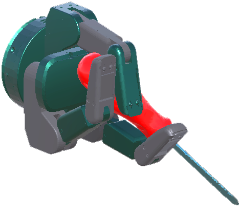
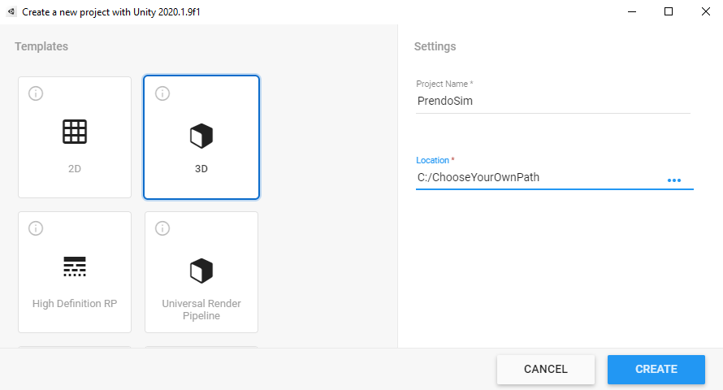
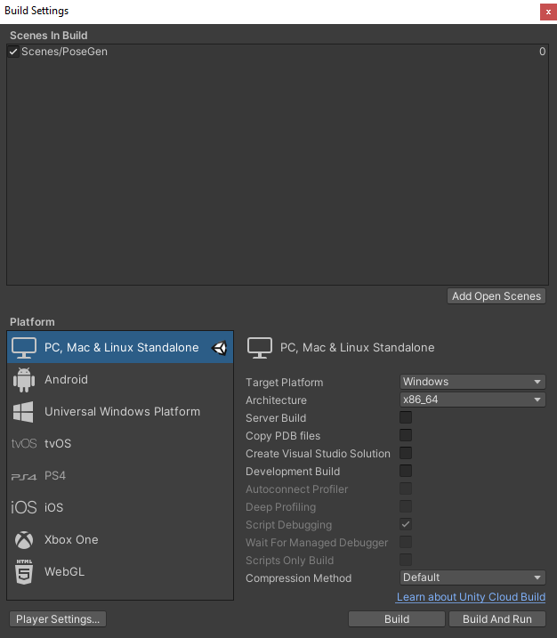
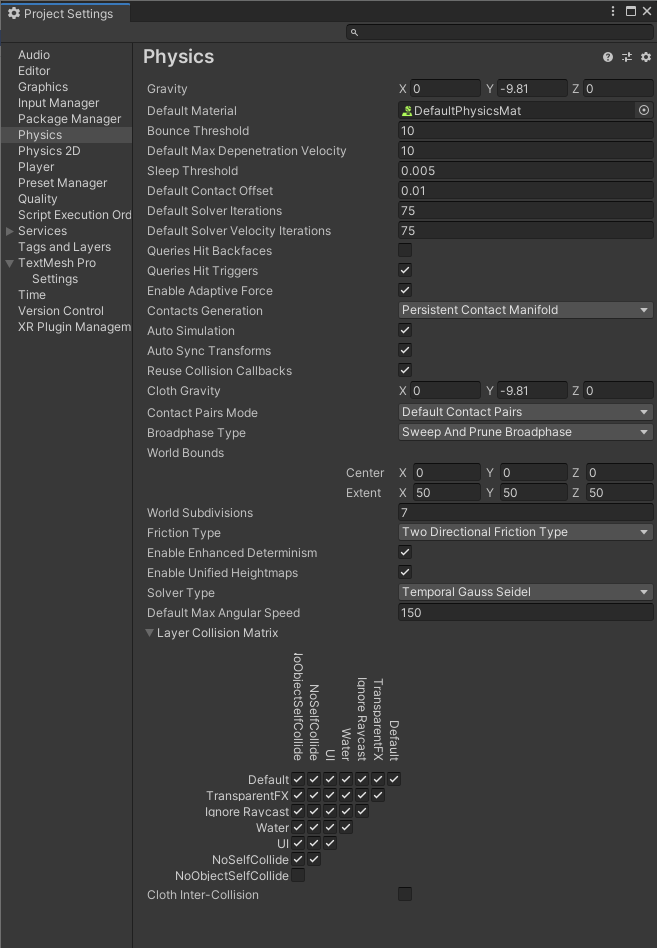
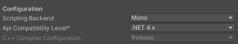

# [PrendoSim](https://prendosim.github.io) < - > [https://github.com/prendosim/prendosim.github.io/](https://github.com/prendosim/prendosim.github.io/)

<p align="left">
  
</p>


PrendoSim is a robot gripper simulator that allows scientists working on robotics to do generate and test viable grasps using a proxy-hand method and a novel grasp stability metric based on the amount of weight that can be withstand. This simulator takes advantage of Unity's latest NVIDIA PhysX 4.1 integration to create physically realistic grasp simulations and outputs joint pose data of the grippers digits (json format), grasped object's position, and images of the grasp from a specified point of view in png format.

Information about the project has been published as Diar Abdlkarim, Valerio Ortenzi, Tommaso Pardi, Maija Filipovica, Alan M. Wing, Katherine J. Kuchenbecker, Massimiliano Di Luca (2021). PrendoSim: Proxy-Hand-Based Robot Grasp Generator, ICINCO 2021 available here: [PrendoSim_Camera_Ready.pdf](https://github.com/prendosim/prendosim.github.io/blob/main/PrendoSim_Camera_Ready.pdf)

Abstract: The synthesis of realistic robot grasps in a simulated environment is pivotal in generating datasets that support sim-to-real transfer learning. In a step toward achieving this goal, we propose PrendoSim, an open-source  [https://prendosim.github.io](https://prendosim.github.io) grasp generator based on a proxy-hand simulation that employs NVIDIA's physics engine (PhysX) and the recently-released articulated-body objects developed by Unity. We present the implementation details, the method used to generate grasps, the approach to operationally-evaluate stability of the generated grasps, and examples of grasps obtained with two different grippers (a parallel jaw gripper and a three-finger hand) grasping three objects selected from the YCB dataset (hammer, screwdriver, and scissors).  Compared to simulators proposed in the literature, PrendoSim balances grasp realism and ease of use, displaying an intuitive interface and enabling the user to produce a large and varied dataset of stable grasps.

## Prerequisites

Before you begin, ensure that the following requirements are met:
<!--- These are just example requirements. Add, duplicate or remove as required --->
* You have installed Unity version `2020.1.9f1` or higher.
* You have a `<Windows/Linux/Mac>` machine.
* You have read changed Unity's `Project Settings` and `Build Settings` as stated here:

1. From Unity Hub 2.4 or higher create a new Unity project with the standard 3D renderer template:

`New Unity Project`



2. Under Unity menu bar press `File` >> `Build Settings`:

`Build Setting`



2. Under Unity menu bar press `Edit` >> `Project Settings` change the following:

`Physics`



`player`



## Importing <PrendoSim>

To use <PrendoSim>, follow these steps:

1. Install the [PrendoSim Unity package](https://github.com/prendosim/prendosim.github.io/blob/main/PrendoSimv1.unitypackage) as such:

Linux and macOS:
```
2. In Unity top menu bar go to `Assets` >> `Import Package` >> `Custom Package` and go to where you have downloaded the `PrendoSim.unitypackage` to.
3. Make sure you import everything.
```

Windows:
```
2. In Unity top menu bar go to `Assets` >> `Import Package` >> `Custom Package` and go to where you have downloaded the `PrendoSim.unitypackage` to.
3. Make sure you import everything.
```

## Using <PrendoSim>

To use <PrendoSim>, follow these steps:

```
1. Make sure you are in the PoseGen2 scene located in the Scenes folder.
2. Then press the Unity `play` button at the top.
3. You should now be able to select simulation parameter options in the user interface shown on the `Game` window.
```

## Contributing to <PrendoSim>
<!--- If your README is long or you have some specific process or steps you want contributors to follow, consider creating a separate CONTRIBUTING.md file--->
To contribute to <PrendoSim>, follow these steps:

1. Fork the [repository](https://github.com/prendosim/prendosim.github.io).
2. Create a branch: `git checkout -b <branch_name>`.
3. Make your changes and commit them: `git commit -m '<commit_message>'`
4. Push to the original branch: `git push origin <project_name>/<location>`
5. Create the pull request.

Alternatively see the GitHub documentation on [creating a pull request](https://help.github.com/en/github/collaborating-with-issues-and-pull-requests/creating-a-pull-request).

<!-- ## Contributors

Thanks to the following people who have contributed to this project:

* [@scottydocs](https://github.com/scottydocs) 📖
* [@cainwatson](https://github.com/cainwatson) 🐛
* [@calchuchesta](https://github.com/calchuchesta) 🐛 -->

You <!-- might want to consider using something like the [All Contributors](https://github.com/all-contributors/all-contributors) specification and its [emoji key](https://allc -->ontributors.org/docs/en/emoji-key).

## Contact

If you want to contact me, you can reach me at <diarkarim@gmail.com>.

## License
<!--- If you're not sure which open license to use see https://choosealicense.com/--->

This project uses the following license: [MIT License
](<https://choosealicense.com/licenses/mit/>).
